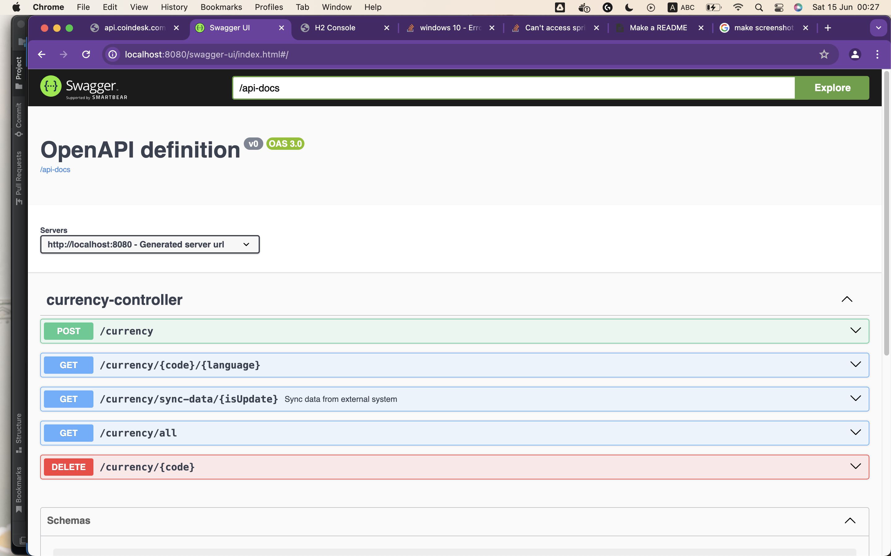

# INITIALIZE

After clone the source code from https://github.com/nmtlttlv1994/coindesk.git


# DOCKER INSTALLATION

1. Navigate to this project location
2. Open terminal / Command Prompt / Power Shell
3. Pull image from docker hub 

```bash
docker pull minhthongnguyen/coindesk:homework
```
4. Checkout and change the environment variable in docker compose if you want
or we will use the default variable.

5. Run docker compose 
```bash
docker compose up -d
```

After project start sucessfully. Here is the link to access swagger-ui

http://{IP}:8080/swagger-ui/index.html#/

In that case, we have localhost so the swagger link will be : http://localhost:8080/swagger-ui/index.html#/  



# Currency controller

- We have these APIs exposed to CRUD , synchronize data from coindesk url: https://api.coindesk.com/v1/bpi/currentprice.json
1. POST: /currency
 - This endpoint to support UPSERT data from the database 

2. GET: /currency/{code}/{language}
 - Description: to get the i18n design, currently we have 2 language "VN", "US"

3. GET: /currency/sync-data/{isUpdate}
 - Description: synchronize data from coindesk, if isUpdate  = true,  there will be create/update to database and return data, else we will
get directly data from coindesk

4. DELETE: /currency/{code}
 - Soft delete the data that we called

# SCHEDULER 

- We have cron trigger the scheduler defined, can set the value via docker-compose.yml, the default value is each 5 minutes the data will by synchronize automatically


THANK YOU FOR READING !! 