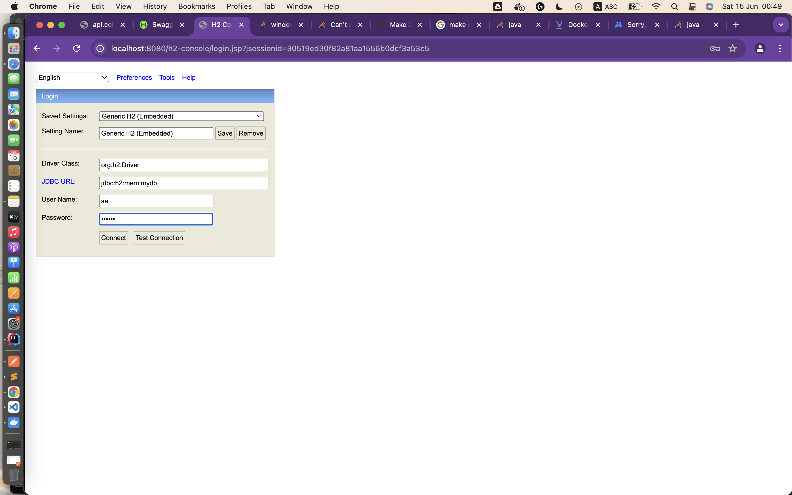

# Initialize

After clone the source code from https://github.com/nmtlttlv1994/coindesk.git

Using docker to installation this project

## Installation

Open terminal

```bash
docker pull minhthongnguyen/coindesk:homework
```

Run docker compose in terminal
```bash
docker compose up
```

After project start sucessfully. Here is the link to access swagger-ui

http://localhost:8080/swagger-ui/index.html#/


and the h2 database:

to access this database using

```bash
username: sa
password: 123456
```


